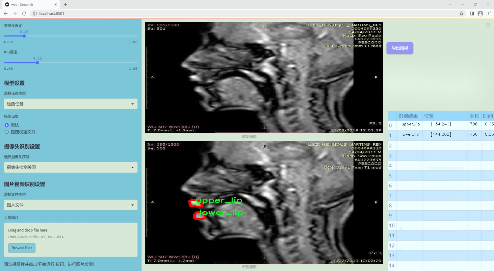
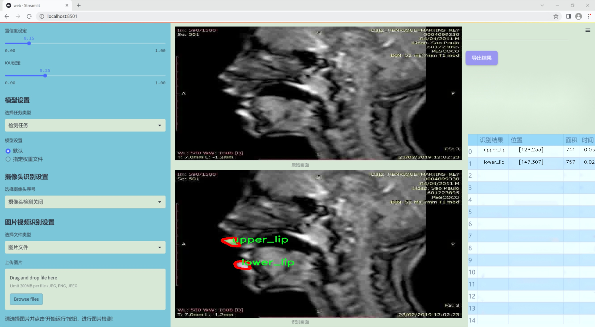
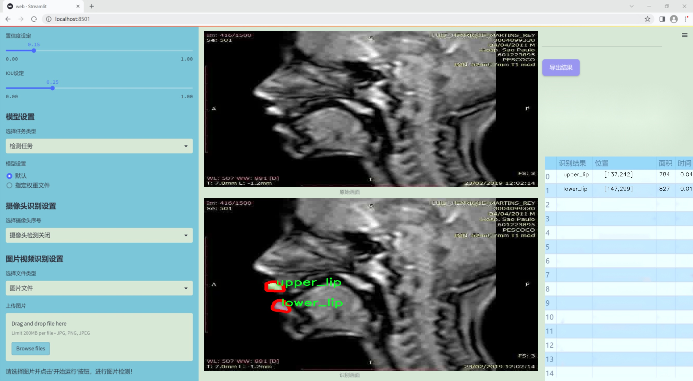
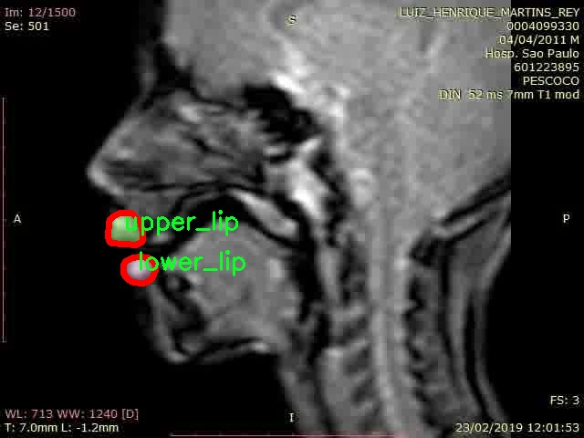
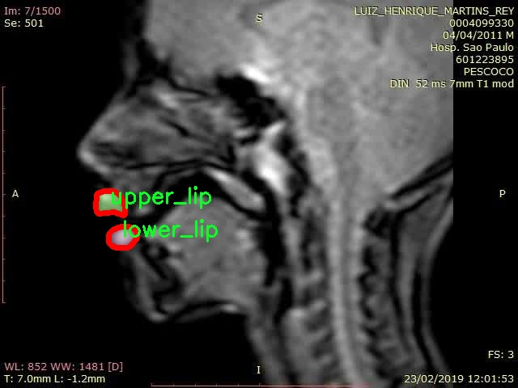
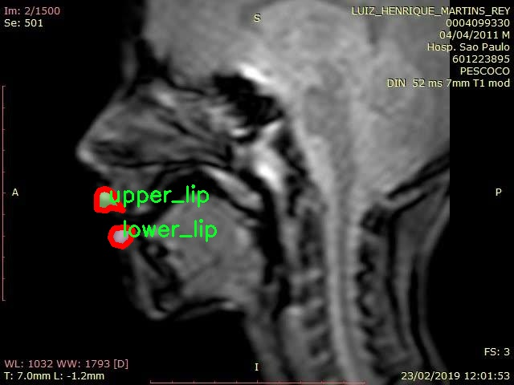
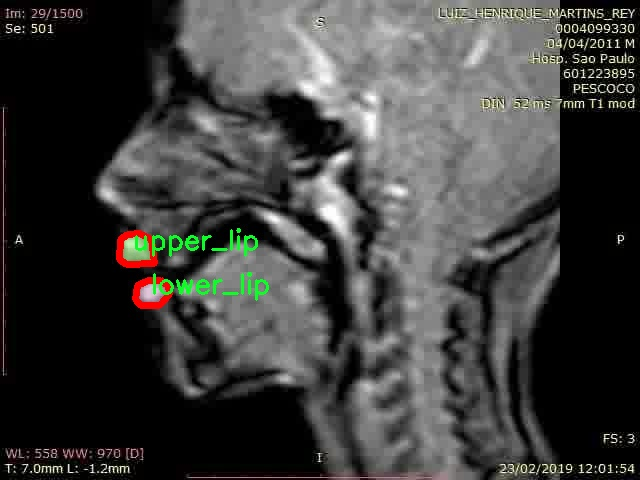

### 1.背景意义

研究背景与意义

在计算机视觉领域，实例分割技术的迅速发展为图像理解和分析提供了新的可能性。尤其是在医疗、化妆品和人机交互等应用场景中，精确的唇部实例分割不仅可以提升图像处理的效率，还能为后续的分析和决策提供可靠的数据支持。近年来，YOLO（You Only Look Once）系列模型因其高效的实时检测能力而受到广泛关注。YOLOv11作为该系列的最新版本，进一步提升了检测精度和速度，成为实例分割任务中的一项重要工具。

本研究旨在基于改进的YOLOv11模型，构建一个针对唇部的实例分割系统。该系统将专注于下唇和上唇两个类别的精确分割，以满足不同应用场景的需求。我们使用的120seg-Instance-Seg数据集包含1200张经过标注的唇部图像，涵盖了多种姿态和光照条件。这一数据集的设计不仅为模型训练提供了丰富的样本，还为后续的性能评估奠定了基础。

唇部的实例分割在多个领域具有重要的应用价值。例如，在医学影像分析中，精确的唇部分割可以帮助医生更好地识别和诊断相关疾病；在化妆品行业，唇部分割技术可以用于虚拟试妆和个性化推荐；在社交媒体和虚拟现实中，唇部识别和分割则可以提升用户体验。因此，基于YOLOv11的唇部实例分割系统的研究不仅具有理论意义，还具备广泛的实际应用前景。

通过本研究，我们希望能够提升唇部实例分割的准确性和效率，为相关领域的研究和应用提供新的技术支持。这将推动计算机视觉技术在实际场景中的应用，促进相关产业的发展与创新。

### 2.视频效果

[2.1 视频效果](https://www.bilibili.com/video/BV19KiyY5EHe/)

### 3.图片效果







##### [项目涉及的源码数据来源链接](https://kdocs.cn/l/cszuIiCKVNis)**

注意：本项目提供训练的数据集和训练教程,由于版本持续更新,暂不提供权重文件（best.pt）,请按照6.训练教程进行训练后实现上图演示的效果。

### 4.数据集信息

##### 4.1 本项目数据集类别数＆类别名

nc: 2
names: ['lower_lip', 'upper_lip']


该项目为【图像分割】数据集，请在【训练教程和Web端加载模型教程（第三步）】这一步的时候按照【图像分割】部分的教程来训练

##### 4.2 本项目数据集信息介绍

本项目数据集信息介绍

本项目旨在改进YOLOv11的X片唇部实例分割系统，所使用的数据集名为“120seg-Instance-Seg”。该数据集专注于唇部的实例分割任务，特别是下唇和上唇的精确识别与分割。数据集中包含两类主要对象，分别为“lower_lip”（下唇）和“upper_lip”（上唇），总类别数量为2。这一分类设计使得模型能够有效地学习和区分唇部的不同部分，从而提高分割的准确性和鲁棒性。

数据集的构建过程涉及多种图像采集技术，确保了样本的多样性和代表性。图像样本涵盖了不同光照条件、角度以及唇部的形态变化，以便于模型在实际应用中能够处理各种复杂情况。此外，数据集中的每一张图像都经过精确标注，确保下唇和上唇的轮廓清晰可辨。这种高质量的标注为模型的训练提供了坚实的基础，使其能够在分割任务中达到更高的性能。

在训练过程中，模型将利用这些标注信息进行特征学习，通过不断迭代优化其参数，以提高对唇部实例的识别和分割能力。随着训练的深入，模型将逐渐掌握如何在不同背景和条件下准确识别出下唇和上唇的边界。这一过程不仅有助于提升模型的分割精度，也为后续的应用提供了强有力的支持。

总之，“120seg-Instance-Seg”数据集为本项目提供了丰富的唇部实例分割样本，结合YOLOv11的先进算法，将推动唇部分割技术的发展，助力相关领域的研究与应用。










### 5.全套项目环境部署视频教程（零基础手把手教学）

[5.1 所需软件PyCharm和Anaconda安装教程（第一步）](https://www.bilibili.com/video/BV1BoC1YCEKi/?spm_id_from=333.999.0.0&vd_source=bc9aec86d164b67a7004b996143742dc)


[5.2 安装Python虚拟环境创建和依赖库安装视频教程（第二步）](https://www.bilibili.com/video/BV1ZoC1YCEBw?spm_id_from=333.788.videopod.sections&vd_source=bc9aec86d164b67a7004b996143742dc)

### 6.改进YOLOv11训练教程和Web_UI前端加载模型教程（零基础手把手教学）

[6.1 改进YOLOv11训练教程和Web_UI前端加载模型教程（第三步）](https://www.bilibili.com/video/BV1BoC1YCEhR?spm_id_from=333.788.videopod.sections&vd_source=bc9aec86d164b67a7004b996143742dc)


按照上面的训练视频教程链接加载项目提供的数据集，运行train.py即可开始训练



     Epoch   gpu_mem       box       obj       cls    labels  img_size
     1/200     20.8G   0.01576   0.01955  0.007536        22      1280: 100%|██████████| 849/849 [14:42<00:00,  1.04s/it]
               Class     Images     Labels          P          R     mAP@.5 mAP@.5:.95: 100%|██████████| 213/213 [01:14<00:00,  2.87it/s]
                 all       3395      17314      0.994      0.957      0.0957      0.0843

     Epoch   gpu_mem       box       obj       cls    labels  img_size
     2/200     20.8G   0.01578   0.01923  0.007006        22      1280: 100%|██████████| 849/849 [14:44<00:00,  1.04s/it]
               Class     Images     Labels          P          R     mAP@.5 mAP@.5:.95: 100%|██████████| 213/213 [01:12<00:00,  2.95it/s]
                 all       3395      17314      0.996      0.956      0.0957      0.0845

     Epoch   gpu_mem       box       obj       cls    labels  img_size
     3/200     20.8G   0.01561    0.0191  0.006895        27      1280: 100%|██████████| 849/849 [10:56<00:00,  1.29it/s]
               Class     Images     Labels          P          R     mAP@.5 mAP@.5:.95: 100%|███████   | 187/213 [00:52<00:00,  4.04it/s]
                 all       3395      17314      0.996      0.957      0.0957      0.0845


###### [项目数据集下载链接](https://kdocs.cn/l/cszuIiCKVNis)

### 7.原始YOLOv11算法讲解

YOLO11采用改进的骨干和颈部架构，增强了特征提取能力，提高了物体检测的精确度和复杂任务的表现。YOLO11引入精炼的架构设计和优化的训练流程，实现更快的处理速度，同时保持精度和性能之间的最佳平衡。通过模型设计的进步，YOLO11m在COCO数据集上实现了更高的均值平均精度（mAP），同时使用比YOLOv8m少22%的参数，使其在不妥协准确性的情况下更加计算高效。YOLO11可以无缝部署在各种环境中，包括边缘设备、云平台以及支持NVIDIA
GPU的系统，确保最大灵活性。无论是物体检测、实例分割、图像分类、姿态估计，还是定向物体检测（OBB），YOLO11都旨在应对多样的计算机视觉挑战。


##### **Ultralytics YOLO11相比于之前版本的主要改进有哪些？**

Ultralytics YOLO11在其前身基础上引入了几项重要进步。主要改进包括：

  1. **增强的特征提取** ：YOLO11采用改进的骨干和颈部架构，增强了特征提取能力，提高了物体检测的精确度。
  2.  **优化的效率和速度** ：精炼的架构设计和优化的训练流程实现了更快的处理速度，同时保持了准确性和性能之间的平衡。
  3.  **更高的准确性与更少的参数** ：YOLO11m在COCO数据集上实现了更高的均值平均精度（mAP），同时使用比YOLOv8m少22%的参数，使其在不妥协准确性的情况下更加计算高效。
  4.  **环境适应性强** ：YOLO11可以在多种环境中部署，包括边缘设备、云平台以及支持NVIDIA GPU的系统。
  5.  **支持广泛的任务** ：YOLO11支持多种计算机视觉任务，如物体检测、实例分割、图像分类、姿态估计和定向物体检测（OBB）。

我们先来看一下其网络结构有什么变化，可以看出，相比较于YOLOv8模型，其将CF2模块改成C3K2，同时在SPPF模块后面添加了一个C2PSA模块，且将YOLOv10的head思想引入到YOLO11的head中，使用深度可分离的方法，减少冗余计算，提高效率。下面我们来详细看一下这两个模块的结构是怎么构成的，以及它们为什么要这样设计


##### C3K2的网络结构

从下面图中我们可以看到，C3K2模块其实就是C2F模块转变出来的，它代码中有一个设置，就是当c3k这个参数为FALSE的时候，C3K2模块就是C2F模块，也就是说它的Bottleneck是普通的Bottleneck；反之当它为true的时候，将Bottleneck模块替换成C3模块。


##### C2PSA的网络结构

` `C2PSA是对 `C2f` 模块的扩展，它结合了PSA(Pointwise Spatial
Attention)块，用于增强特征提取和注意力机制。通过在标准 `C2f` 模块中引入 PSA
块，C2PSA实现了更强大的注意力机制，从而提高了模型对重要特征的捕捉能力。


##### **C2f 模块回顾：**

**** C2f模块是一个更快的 CSP（Cross Stage Partial）瓶颈实现，它通过两个卷积层和多个 Bottleneck
块进行特征提取。相比传统的 CSPNet，C2f 优化了瓶颈层的结构，使得计算速度更快。在 C2f中，`cv1` 是第一个 1x1
卷积，用于减少通道数；`cv2` 是另一个 1x1 卷积，用于恢复输出通道数。而 `n` 是一个包含 Bottleneck 块的数量，用于提取特征。

##### **C2PSA 模块的增强** ：

**C2PSA** 扩展了 C2f，通过引入PSA( **Position-Sensitive Attention)**
，旨在通过多头注意力机制和前馈神经网络来增强特征提取能力。它可以选择性地添加残差结构（shortcut）以优化梯度传播和网络训练效果。同时，使用FFN
可以将输入特征映射到更高维的空间，捕获输入特征的复杂非线性关系，允许模型学习更丰富的特征表示。

##### head部分

YOLO11在head部分的cls分支上使用深度可分离卷积 ，具体代码如下，cv2边界框回归分支，cv3分类分支。

    
    
     self.cv2 = nn.ModuleList(
                nn.Sequential(Conv(x, c2, 3), Conv(c2, c2, 3), nn.Conv2d(c2, 4 * self.reg_max, 1)) for x in ch
            )
            self.cv3 = nn.ModuleList(
                nn.Sequential(
                    nn.Sequential(DWConv(x, x, 3), Conv(x, c3, 1)),
                    nn.Sequential(DWConv(c3, c3, 3), Conv(c3, c3, 1)),
                    nn.Conv2d(c3, self.nc, 1),
                )
                for x in ch
            )


### 8.200+种全套改进YOLOV11创新点原理讲解

#### 8.1 200+种全套改进YOLOV11创新点原理讲解大全

由于篇幅限制，每个创新点的具体原理讲解就不全部展开，具体见下列网址中的改进模块对应项目的技术原理博客网址【Blog】（创新点均为模块化搭建，原理适配YOLOv5~YOLOv11等各种版本）

[改进模块技术原理博客【Blog】网址链接](https://gitee.com/qunmasj/good)


#### 8.2 精选部分改进YOLOV11创新点原理讲解

###### 这里节选部分改进创新点展开原理讲解(完整的改进原理见上图和[改进模块技术原理博客链接](https://gitee.com/qunmasj/good)【如果此小节的图加载失败可以通过CSDN或者Github搜索该博客的标题访问原始博客，原始博客图片显示正常】


### Context_Grided_Network(CGNet)简介
参考该博客提出的一种轻量化语义分割模型Context Grided Network(CGNet)，以满足设备的运行需要。

CGNet主要由CG块构建而成，CG块可以学习局部特征和周围环境上下文的联合特征，最后通过引入全局上下文特征进一步改善联合特征的学习。


 
下图给出了在Cityscapes数据集上对现有的一些语义分割模型的测试效果，横轴表示参数量，纵轴表示准确率(mIoU)。可以看出，在参数量较少的情况下，CGNet可以达到一个比较好的准确率。虽与高精度模型相去甚远，但在一些对精度要求不高、对实时性要求比较苛刻的情况下，很有价值。


高精度模型，如DeepLab、DFN、DenseASPP等，动不动就是几十M的参数，很难应用在移动设备上。而上图中红色的模型，相对内存占用较小，但它们的分割精度却不是很高。作者认为主要原因是，这些小网络大多遵循着分类网络的设计思路，并没有考虑语义分割任务更深层次的特点。

空间依赖性和上下文信息对提高分割精度有很大的作用。作者从该角度出发，提出了CG block，并进一步搭建了轻量级语义分割网络CGNet。CG块具有以下特点： 

学习局部特征和上下文特征的联合特征；
通过全局上下文特征改进上述联合特征；
可以贯穿应用在整个网络中，从low level（空间级别）到high level（语义级别）。不像PSPNet、DFN、DenseASPP等，只在编码阶段以后捕捉上下文特征。；
只有3个下采样，相比一般5个下采样的网络，能够更好地保留边缘信息。
CGNet遵循“深而薄”的原则设计，整个网络又51层构成。其中，为了降低计算，大量使用了channel-wise conv.

小型语义分割模型：

需要平衡准确率和系统开销
进化路线：ENet -> ICNet -> ESPNet
这些模型基本都基于分类网络设计，在分割准确率上效果并不是很好
上下文信息模型：

大多数现有模型只考虑解码阶段的上下文信息并且没有利用周围的上下文信息
注意力机制：

CG block使用全局上下文信息计算权重向量，并使用其细化局部特征和周围上下文特征的联合特征

#### Context Guided Block
CG block由4部分组成：


此外，CG block还采用了残差学习。文中提出了局部残差学习（LRL）和全局残差学习（GRL）两种方式。 LRL添加了从输入到联合特征提取器的连接，GRL添加了从输入到全局特征提取器的连接。从直观上来说，GRL比LRL更能促进网络中的信息传递（更像ResNet~~），后面实验部分也进行了测试，的确GRL更能提升分割精度。


CGNet的通用网络结构如下图所示，分为3个stage，第一个stage使用3个卷积层抽取特征，第二和第三个stage堆叠一定数量的CG block，具体个数可以根据情况调整。最后，通过1x1 conv得到分割结果。


下图是用于Cityscapes数据集的CGNet网络细节说明：输入尺寸为3*680*680；stage1连续使用了3个Conv-BN-PReLU组合，首个组合使用了stride=2的卷积，所以得到了1/2分辨率的feature map；stage2和stage3分别使用了多个CG block，且其中使用了不同大小的膨胀卷积核，最终分别得到了1/4和1/8的feature map。

需注意：

stage2&3的输入特征分别由其上一个stage的首个和最后一个block组合给出（参考上图的绿色箭头）；

输入注入机制，图中未体现，实际使用中，作者还将输入图像下采样1/4或1/8，分别给到stage2和stage3的输入中 ，以进一步加强特征传递。

channel-wise conv。为了缩减参数数量，在局部特征提取器和周围上下文特征提取器中使用了channel-wise卷积，可以消除跨通道的计算成本，同时节省内存占用。但是，没有像MobileNet等模型一样，在depth-wise卷积后面接point-wise卷积（1*1 conv），作者解释是，因为CG block需要保持局部特征和周围上下文特征的独立性，而1*1 conv会破坏这种独立性，所以效果欠佳，实验部分也进行了验证。

个人感觉此处应该指的是depth-wise卷积？

官方Git中对该部分的实现如下：


### 9.系统功能展示

图9.1.系统支持检测结果表格显示

  图9.2.系统支持置信度和IOU阈值手动调节

  图9.3.系统支持自定义加载权重文件best.pt(需要你通过步骤5中训练获得)

  图9.4.系统支持摄像头实时识别

  图9.5.系统支持图片识别

  图9.6.系统支持视频识别

  图9.7.系统支持识别结果文件自动保存

  图9.8.系统支持Excel导出检测结果数据


### 10. YOLOv11核心改进源码讲解

#### 10.1 conv.py

以下是对代码中最核心部分的提取和详细注释。代码主要涉及卷积模块的实现，包括标准卷积、深度可分离卷积、注意力机制等。以下是简化后的核心代码及其注释：

```python
import torch
import torch.nn as nn
import math

def autopad(k, p=None, d=1):
    """自动计算填充以保持输出形状与输入相同。"""
    if d > 1:
        k = d * (k - 1) + 1 if isinstance(k, int) else [d * (x - 1) + 1 for x in k]  # 实际的卷积核大小
    if p is None:
        p = k // 2 if isinstance(k, int) else [x // 2 for x in k]  # 自动填充
    return p

class Conv(nn.Module):
    """标准卷积层，包含卷积、批归一化和激活函数。"""

    default_act = nn.SiLU()  # 默认激活函数

    def __init__(self, c1, c2, k=1, s=1, p=None, g=1, d=1, act=True):
        """初始化卷积层。"""
        super().__init__()
        self.conv = nn.Conv2d(c1, c2, k, s, autopad(k, p, d), groups=g, dilation=d, bias=False)
        self.bn = nn.BatchNorm2d(c2)  # 批归一化
        self.act = self.default_act if act is True else act if isinstance(act, nn.Module) else nn.Identity()

    def forward(self, x):
        """前向传播：卷积 -> 批归一化 -> 激活函数。"""
        return self.act(self.bn(self.conv(x)))

class DWConv(Conv):
    """深度卷积层，适用于深度可分离卷积。"""

    def __init__(self, c1, c2, k=1, s=1, d=1, act=True):
        """初始化深度卷积层。"""
        super().__init__(c1, c2, k, s, g=math.gcd(c1, c2), d=d, act=act)

class DSConv(nn.Module):
    """深度可分离卷积层。"""

    def __init__(self, c1, c2, k=1, s=1, d=1, act=True):
        super().__init__()
        self.dwconv = DWConv(c1, c1, 3)  # 深度卷积
        self.pwconv = Conv(c1, c2, 1)  # 点卷积

    def forward(self, x):
        """前向传播：深度卷积 -> 点卷积。"""
        return self.pwconv(self.dwconv(x))

class ChannelAttention(nn.Module):
    """通道注意力模块。"""

    def __init__(self, channels: int):
        """初始化通道注意力模块。"""
        super().__init__()
        self.pool = nn.AdaptiveAvgPool2d(1)  # 自适应平均池化
        self.fc = nn.Conv2d(channels, channels, 1, 1, 0, bias=True)  # 1x1卷积
        self.act = nn.Sigmoid()  # Sigmoid激活函数

    def forward(self, x: torch.Tensor) -> torch.Tensor:
        """前向传播：计算通道注意力并应用于输入。"""
        return x * self.act(self.fc(self.pool(x)))

class SpatialAttention(nn.Module):
    """空间注意力模块。"""

    def __init__(self, kernel_size=7):
        """初始化空间注意力模块。"""
        super().__init__()
        assert kernel_size in {3, 7}, "kernel size must be 3 or 7"
        padding = 3 if kernel_size == 7 else 1
        self.cv1 = nn.Conv2d(2, 1, kernel_size, padding=padding, bias=False)  # 卷积层
        self.act = nn.Sigmoid()  # Sigmoid激活函数

    def forward(self, x):
        """前向传播：计算空间注意力并应用于输入。"""
        return x * self.act(self.cv1(torch.cat([torch.mean(x, 1, keepdim=True), torch.max(x, 1, keepdim=True)[0]], 1)))

class CBAM(nn.Module):
    """卷积块注意力模块。"""

    def __init__(self, c1, kernel_size=7):
        """初始化CBAM模块。"""
        super().__init__()
        self.channel_attention = ChannelAttention(c1)  # 通道注意力
        self.spatial_attention = SpatialAttention(kernel_size)  # 空间注意力

    def forward(self, x):
        """前向传播：依次应用通道和空间注意力。"""
        return self.spatial_attention(self.channel_attention(x))
```

### 代码说明：
1. **autopad**：用于自动计算卷积的填充，以确保输出的形状与输入相同。
2. **Conv**：标准卷积层，包含卷积操作、批归一化和激活函数的组合。
3. **DWConv**：深度卷积，适用于深度可分离卷积的实现。
4. **DSConv**：深度可分离卷积，结合深度卷积和点卷积。
5. **ChannelAttention**：通道注意力模块，通过自适应平均池化和1x1卷积来计算通道权重。
6. **SpatialAttention**：空间注意力模块，通过卷积和激活函数来计算空间权重。
7. **CBAM**：卷积块注意力模块，结合通道和空间注意力以增强特征表示。

这些模块在深度学习模型中广泛应用，尤其是在目标检测和图像分割等任务中。

这个文件 `conv.py` 是一个实现了多种卷积模块的 PyTorch 代码，主要用于深度学习中的卷积神经网络（CNN）。文件中定义了一系列卷积层，包括标准卷积、深度卷积、转置卷积等，同时还实现了一些注意力机制和特征融合的模块。

首先，文件导入了必要的库，包括 `math`、`numpy` 和 `torch`，并定义了一个 `__all__` 列表，列出了可以被外部导入的模块名称。

接下来，定义了一个辅助函数 `autopad`，该函数用于根据卷积核的大小、填充和扩张因子自动计算填充量，以确保输出的形状与输入相同。

`Conv` 类是标准卷积层的实现，包含卷积操作、批归一化和激活函数。构造函数接受多个参数，如输入通道数、输出通道数、卷积核大小、步幅、填充、分组数和扩张因子。`forward` 方法定义了前向传播过程，依次进行卷积、批归一化和激活。

`Conv2` 类是对 `Conv` 类的扩展，增加了一个 1x1 的卷积层，以实现更复杂的特征提取。它的 `forward` 方法将两个卷积的输出相加，并通过激活函数进行处理。

`LightConv` 类实现了一种轻量级卷积，首先通过 1x1 卷积减少通道数，然后使用深度卷积进行特征提取。

`DWConv` 类实现了深度卷积，主要用于处理每个输入通道的特征，减少计算量。

`DSConv` 类实现了深度可分离卷积，先进行深度卷积，再通过 1x1 卷积进行通道的组合。

`DWConvTranspose2d` 类是深度转置卷积的实现，继承自 PyTorch 的 `ConvTranspose2d` 类。

`ConvTranspose` 类实现了转置卷积层，支持批归一化和激活函数。

`Focus` 类用于将空间信息聚焦到通道维度，通过对输入张量进行下采样和拼接，然后通过卷积进行处理。

`GhostConv` 类实现了 Ghost 卷积，使用主要和次要操作来高效学习特征。

`RepConv` 类是一个基础的重复卷积模块，支持训练和部署状态，能够融合多个卷积层的权重。

`ChannelAttention` 和 `SpatialAttention` 类实现了通道注意力和空间注意力机制，分别通过全局平均池化和卷积操作来增强特征。

`CBAM` 类结合了通道注意力和空间注意力，形成一个完整的卷积块注意力模块。

最后，`Concat` 类用于在指定维度上拼接多个张量。

整体来看，这个文件实现了多种卷积操作和注意力机制，适用于构建高效的卷积神经网络，特别是在目标检测和图像处理等任务中。每个模块都可以根据需要进行组合和扩展，以满足不同的网络架构需求。

#### 10.2 dynamic_snake_conv.py

以下是经过简化和注释的核心代码部分，主要包括 `DySnakeConv` 和 `DSConv` 类，以及 `DSC` 类中的一些关键方法。

```python
import torch
import torch.nn as nn

class DySnakeConv(nn.Module):
    def __init__(self, inc, ouc, k=3) -> None:
        super().__init__()
        # 初始化三个卷积层
        self.conv_0 = Conv(inc, ouc, k)  # 标准卷积
        self.conv_x = DSConv(inc, ouc, 0, k)  # 沿x轴的动态蛇卷积
        self.conv_y = DSConv(inc, ouc, 1, k)  # 沿y轴的动态蛇卷积
    
    def forward(self, x):
        # 将三个卷积的输出在通道维度上拼接
        return torch.cat([self.conv_0(x), self.conv_x(x), self.conv_y(x)], dim=1)

class DSConv(nn.Module):
    def __init__(self, in_ch, out_ch, morph, kernel_size=3, if_offset=True, extend_scope=1):
        """
        动态蛇卷积
        :param in_ch: 输入通道数
        :param out_ch: 输出通道数
        :param kernel_size: 卷积核大小
        :param extend_scope: 扩展范围（默认1）
        :param morph: 卷积核的形态，0表示沿x轴，1表示沿y轴
        :param if_offset: 是否需要偏移，False表示标准卷积
        """
        super(DSConv, self).__init__()
        # 用于学习可变形偏移的卷积层
        self.offset_conv = nn.Conv2d(in_ch, 2 * kernel_size, 3, padding=1)
        self.bn = nn.BatchNorm2d(2 * kernel_size)  # 批归一化
        self.kernel_size = kernel_size

        # 两种类型的动态蛇卷积（沿x轴和y轴）
        self.dsc_conv_x = nn.Conv2d(in_ch, out_ch, kernel_size=(kernel_size, 1), stride=(kernel_size, 1), padding=0)
        self.dsc_conv_y = nn.Conv2d(in_ch, out_ch, kernel_size=(1, kernel_size), stride=(1, kernel_size), padding=0)

        self.gn = nn.GroupNorm(out_ch // 4, out_ch)  # 组归一化
        self.act = Conv.default_act  # 默认激活函数

        self.extend_scope = extend_scope
        self.morph = morph
        self.if_offset = if_offset

    def forward(self, f):
        # 计算偏移
        offset = self.offset_conv(f)
        offset = self.bn(offset)
        offset = torch.tanh(offset)  # 将偏移限制在[-1, 1]之间

        # 创建坐标映射
        dsc = DSC(f.shape, self.kernel_size, self.extend_scope, self.morph)
        deformed_feature = dsc.deform_conv(f, offset, self.if_offset)  # 进行可变形卷积

        # 根据形态选择对应的卷积
        if self.morph == 0:
            x = self.dsc_conv_x(deformed_feature.type(f.dtype))
        else:
            x = self.dsc_conv_y(deformed_feature.type(f.dtype))
        
        x = self.gn(x)  # 归一化
        x = self.act(x)  # 激活
        return x

class DSC(object):
    def __init__(self, input_shape, kernel_size, extend_scope, morph):
        self.num_points = kernel_size  # 卷积核的点数
        self.width = input_shape[2]  # 输入宽度
        self.height = input_shape[3]  # 输入高度
        self.morph = morph  # 卷积形态
        self.extend_scope = extend_scope  # 偏移扩展范围

        # 定义特征图的形状
        self.num_batch = input_shape[0]  # 批大小
        self.num_channels = input_shape[1]  # 通道数

    def _coordinate_map_3D(self, offset, if_offset):
        # 计算3D坐标映射
        # 这里省略了具体实现细节
        pass

    def _bilinear_interpolate_3D(self, input_feature, y, x):
        # 进行双线性插值
        # 这里省略了具体实现细节
        pass

    def deform_conv(self, input, offset, if_offset):
        # 执行可变形卷积
        y, x = self._coordinate_map_3D(offset, if_offset)  # 获取坐标映射
        deformed_feature = self._bilinear_interpolate_3D(input, y, x)  # 进行插值
        return deformed_feature
```

### 代码说明：
1. **DySnakeConv 类**：定义了一个动态蛇卷积层，包含标准卷积和两个动态蛇卷积（分别沿x轴和y轴）。在前向传播中，将三个卷积的输出拼接在一起。

2. **DSConv 类**：实现了动态蛇卷积的具体逻辑，包括偏移学习和卷积操作。通过 `offset_conv` 学习偏移，并根据形态选择不同的卷积操作。

3. **DSC 类**：负责计算坐标映射和进行可变形卷积的细节。包括计算偏移后的坐标和进行双线性插值的函数。

以上代码简化了原始代码的复杂性，保留了核心功能，并提供了详细的中文注释以帮助理解。

这个程序文件 `dynamic_snake_conv.py` 实现了一个动态蛇形卷积（Dynamic Snake Convolution）模块，主要用于深度学习中的卷积操作。文件中包含了两个主要的类：`DySnakeConv` 和 `DSConv`，以及一个辅助类 `DSC`。

首先，`DySnakeConv` 类是一个卷积层的封装，它继承自 `nn.Module`。在初始化方法中，定义了三个卷积层：`conv_0` 是标准卷积，`conv_x` 和 `conv_y` 是动态蛇形卷积，分别沿着 x 轴和 y 轴进行操作。`forward` 方法接收输入张量 `x`，并将三个卷积的输出在通道维度上进行拼接，形成最终的输出。

接下来，`DSConv` 类实现了动态蛇形卷积的具体逻辑。它同样继承自 `nn.Module`，在初始化时定义了输入和输出通道数、卷积核大小、形态（morph）、是否使用偏移（if_offset）等参数。该类的 `forward` 方法首先通过一个卷积层计算出偏移量，然后利用这些偏移量对输入特征图进行变形卷积操作。根据 `morph` 参数的不同，选择不同的卷积方式（沿 x 轴或 y 轴）。

`DSC` 类是一个辅助类，负责计算坐标映射和双线性插值。它的 `_coordinate_map_3D` 方法根据偏移量生成新的坐标映射，`_bilinear_interpolate_3D` 方法则根据这些坐标对输入特征图进行双线性插值，得到变形后的特征图。`deform_conv` 方法结合了这两个步骤，完成了变形卷积的过程。

整体来看，这个文件实现了一个灵活的卷积操作，能够根据输入的特征图和学习到的偏移量动态调整卷积核的位置，从而提高卷积神经网络在特征提取上的能力。

#### 10.3 metaformer.py

以下是代码中最核心的部分，并附上详细的中文注释：

```python
import torch
import torch.nn as nn
import torch.nn.functional as F

class MF_Attention(nn.Module):
    """
    自注意力机制的实现，参考Transformer模型。
    """
    def __init__(self, dim, head_dim=32, num_heads=None, qkv_bias=False,
                 attn_drop=0., proj_drop=0., proj_bias=False):
        super().__init__()

        # 设置每个头的维度
        self.head_dim = head_dim
        # 缩放因子
        self.scale = head_dim ** -0.5

        # 计算头的数量
        self.num_heads = num_heads if num_heads else dim // head_dim
        if self.num_heads == 0:
            self.num_heads = 1
        
        # 计算注意力的维度
        self.attention_dim = self.num_heads * self.head_dim

        # 定义线性层用于计算Q、K、V
        self.qkv = nn.Linear(dim, self.attention_dim * 3, bias=qkv_bias)
        # 定义注意力的dropout层
        self.attn_drop = nn.Dropout(attn_drop)
        # 定义输出的线性层
        self.proj = nn.Linear(self.attention_dim, dim, bias=proj_bias)
        # 定义输出的dropout层
        self.proj_drop = nn.Dropout(proj_drop)

    def forward(self, x):
        # 获取输入的批次大小、高度、宽度和通道数
        B, H, W, C = x.shape
        N = H * W  # 计算总的token数量

        # 计算Q、K、V
        qkv = self.qkv(x).reshape(B, N, 3, self.num_heads, self.head_dim).permute(2, 0, 3, 1, 4)
        q, k, v = qkv.unbind(0)  # 分离Q、K、V

        # 计算注意力分数
        attn = (q @ k.transpose(-2, -1)) * self.scale
        attn = attn.softmax(dim=-1)  # 归一化
        attn = self.attn_drop(attn)  # 应用dropout

        # 计算输出
        x = (attn @ v).transpose(1, 2).reshape(B, H, W, self.attention_dim)
        x = self.proj(x)  # 线性变换
        x = self.proj_drop(x)  # 应用dropout
        return x  # 返回最终的输出

class MetaFormerBlock(nn.Module):
    """
    MetaFormer块的实现。
    """
    def __init__(self, dim,
                 token_mixer=nn.Identity, mlp=Mlp,
                 norm_layer=partial(LayerNormWithoutBias, eps=1e-6),
                 drop=0., drop_path=0.,
                 layer_scale_init_value=None, res_scale_init_value=None):
        super().__init__()

        # 归一化层
        self.norm1 = norm_layer(dim)
        # 令牌混合器
        self.token_mixer = token_mixer(dim=dim, drop=drop)
        # 路径丢弃
        self.drop_path1 = DropPath(drop_path) if drop_path > 0. else nn.Identity()
        # 层缩放
        self.layer_scale1 = Scale(dim=dim, init_value=layer_scale_init_value) if layer_scale_init_value else nn.Identity()
        self.res_scale1 = Scale(dim=dim, init_value=res_scale_init_value) if res_scale_init_value else nn.Identity()

        # 第二个归一化层
        self.norm2 = norm_layer(dim)
        # MLP层
        self.mlp = mlp(dim=dim, drop=drop)
        self.drop_path2 = DropPath(drop_path) if drop_path > 0. else nn.Identity()
        self.layer_scale2 = Scale(dim=dim, init_value=layer_scale_init_value) if layer_scale_init_value else nn.Identity()
        self.res_scale2 = Scale(dim=dim, init_value=res_scale_init_value) if res_scale_init_value else nn.Identity()

    def forward(self, x):
        # 进行维度转换
        x = x.permute(0, 2, 3, 1)
        # 第一部分：归一化 -> 令牌混合 -> 路径丢弃 -> 层缩放
        x = self.res_scale1(x) + \
            self.layer_scale1(
                self.drop_path1(
                    self.token_mixer(self.norm1(x))
                )
            )
        # 第二部分：归一化 -> MLP -> 路径丢弃 -> 层缩放
        x = self.res_scale2(x) + \
            self.layer_scale2(
                self.drop_path2(
                    self.mlp(self.norm2(x))
                )
            )
        return x.permute(0, 3, 1, 2)  # 返回最终的输出，恢复维度
```

### 代码核心部分说明：
1. **MF_Attention**: 实现了自注意力机制，包含了Q、K、V的计算，以及注意力分数的归一化和输出的线性变换。
2. **MetaFormerBlock**: 实现了MetaFormer的基本结构，包含了归一化、令牌混合、MLP和残差连接的操作。通过组合这些操作来构建深度学习模型的基本单元。

这个程序文件 `metaformer.py` 实现了一些用于构建 MetaFormer 模型的基本组件，主要包括各种层和模块，适用于深度学习中的图像处理任务。文件中使用了 PyTorch 框架，并且包含了一些常用的操作，如自注意力机制、激活函数、归一化等。

首先，文件定义了一些基础类。`Scale` 类用于通过元素乘法对输入进行缩放，可以选择是否训练这个缩放参数。`SquaredReLU` 和 `StarReLU` 是两种不同的激活函数，前者是对 ReLU 的平方，后者则是对 ReLU 输出进行缩放和偏置处理。

接下来，`MF_Attention` 类实现了标准的自注意力机制，类似于 Transformer 中的自注意力。它通过线性变换生成查询、键和值，并计算注意力权重，最后通过线性变换和 dropout 输出结果。

`RandomMixing` 类用于对输入进行随机混合，通过生成一个随机矩阵来实现。`LayerNormGeneral` 类是一个通用的层归一化实现，可以根据输入的形状灵活调整归一化的维度和参数。

`SepConv` 类实现了分离卷积，使用了逐点卷积和深度卷积的组合。`Pooling` 类实现了一种池化操作，主要用于 PoolFormer 模型。

`Mlp` 类定义了一个多层感知机（MLP），通常用于 MetaFormer 模型中，包含两个线性层和激活函数。`ConvolutionalGLU` 类实现了一种卷积门控线性单元（GLU），结合了卷积操作和激活函数。

`MetaFormerBlock` 和 `MetaFormerCGLUBlock` 类分别实现了 MetaFormer 的基本模块，前者使用标准的 MLP，后者使用卷积 GLU。它们都包含了归一化、混合和残差连接的操作，以增强模型的表达能力。

整个文件通过定义这些模块，提供了构建 MetaFormer 及其变种的基础，用户可以根据需要组合这些组件来实现不同的网络结构。每个模块都可以根据具体任务进行调整和优化，以适应不同的输入和需求。

#### 10.4 FreqFusion.py

以下是经过简化和注释的核心代码部分，主要包括 `FreqFusion` 类及其相关方法。这个类实现了频率感知特征融合，用于密集图像预测。

```python
import torch
import torch.nn as nn
import torch.nn.functional as F

class FreqFusion(nn.Module):
    def __init__(self, channels, scale_factor=1, lowpass_kernel=5, highpass_kernel=3, **kwargs):
        super().__init__()
        hr_channels, lr_channels = channels
        self.scale_factor = scale_factor
        self.lowpass_kernel = lowpass_kernel
        self.highpass_kernel = highpass_kernel
        
        # 压缩高分辨率和低分辨率特征通道
        self.compressed_channels = (hr_channels + lr_channels) // 8
        self.hr_channel_compressor = nn.Conv2d(hr_channels, self.compressed_channels, 1)
        self.lr_channel_compressor = nn.Conv2d(lr_channels, self.compressed_channels, 1)

        # 内容编码器，用于生成低通和高通滤波器
        self.content_encoder = nn.Conv2d(
            self.compressed_channels,
            lowpass_kernel ** 2,
            kernel_size=3,
            padding=1
        )
        self.content_encoder2 = nn.Conv2d(
            self.compressed_channels,
            highpass_kernel ** 2,
            kernel_size=3,
            padding=1
        )

    def kernel_normalizer(self, mask, kernel):
        """
        归一化卷积核，确保其和为1。
        """
        mask = F.softmax(mask, dim=1)  # 对mask进行softmax处理
        mask = mask / mask.sum(dim=(-1, -2), keepdims=True)  # 归一化
        return mask

    def forward(self, x):
        """
        前向传播，接收高分辨率和低分辨率特征并进行融合。
        """
        hr_feat, lr_feat = x  # 拆分输入特征
        compressed_hr_feat = self.hr_channel_compressor(hr_feat)  # 压缩高分辨率特征
        compressed_lr_feat = self.lr_channel_compressor(lr_feat)  # 压缩低分辨率特征

        # 生成低通和高通滤波器
        mask_lr = self.content_encoder(compressed_hr_feat) + self.content_encoder(compressed_lr_feat)
        mask_hr = self.content_encoder2(compressed_hr_feat) + self.content_encoder2(compressed_lr_feat)

        # 归一化卷积核
        mask_lr = self.kernel_normalizer(mask_lr, self.lowpass_kernel)
        mask_hr = self.kernel_normalizer(mask_hr, self.highpass_kernel)

        # 使用卷积核对特征进行处理
        lr_feat = F.conv2d(lr_feat, mask_lr)  # 低分辨率特征处理
        hr_feat = F.conv2d(hr_feat, mask_hr)  # 高分辨率特征处理

        return hr_feat + lr_feat  # 返回融合后的特征

# 示例用法
# freq_fusion = FreqFusion(channels=(64, 32))
# output = freq_fusion((high_res_feature, low_res_feature))
```

### 代码注释说明：

1. **类定义**：`FreqFusion` 类继承自 `nn.Module`，用于实现频率感知特征融合。
2. **初始化方法**：`__init__` 方法中定义了高分辨率和低分辨率特征的通道压缩，以及低通和高通滤波器的卷积层。
3. **卷积核归一化**：`kernel_normalizer` 方法用于对生成的卷积核进行归一化处理，确保其和为1，以便在后续的卷积操作中不会改变特征的整体能量。
4. **前向传播**：`forward` 方法接收高分辨率和低分辨率特征，进行压缩、生成滤波器、归一化，并最终融合特征。

该代码的核心逻辑是通过频率感知的方法，将不同分辨率的特征进行融合，以提高图像预测的效果。

这个程序文件 `FreqFusion.py` 实现了一种频率感知特征融合的方法，主要用于密集图像预测任务。代码中使用了 PyTorch 框架，定义了一个名为 `FreqFusion` 的神经网络模块，旨在通过高频和低频特征的融合来提高图像的重建质量。

首先，文件中导入了必要的库，包括 PyTorch 的核心模块和一些函数。接着，定义了一些初始化函数，例如 `normal_init` 和 `constant_init`，用于初始化神经网络的权重和偏置。`resize` 函数用于调整输入张量的大小，支持不同的插值模式，并在必要时发出警告。

接下来，`hamming2D` 函数用于生成二维 Hamming 窗口，这在后续的特征融合过程中可能会用到。`FreqFusion` 类是整个程序的核心，包含了多个参数和子模块，用于处理高分辨率和低分辨率特征的融合。

在 `__init__` 方法中，初始化了一些卷积层和参数，包括用于压缩高分辨率和低分辨率特征的卷积层、用于生成低通和高通滤波器的卷积层等。该类还支持特征重采样、残差连接等功能，允许用户根据需要选择是否使用这些功能。

`init_weights` 方法用于初始化网络中卷积层的权重，确保模型在训练开始时具有良好的初始状态。`kernel_normalizer` 方法用于对生成的掩码进行归一化处理，以确保其在后续操作中的有效性。

`forward` 方法是模型的前向传播过程，它接收高分辨率和低分辨率特征，并根据配置选择是否使用检查点机制来节省内存。`_forward` 方法则是实际的计算过程，包括特征的压缩、掩码的生成以及高频和低频特征的融合。

在 `_forward` 方法中，首先对输入的高分辨率和低分辨率特征进行压缩，然后根据是否使用半卷积和其他配置生成相应的掩码。通过对掩码的处理，最终得到融合后的高分辨率特征和低分辨率特征的输出。

此外，`LocalSimGuidedSampler` 类实现了一个偏移生成器，用于在特征融合过程中生成采样偏移。它根据输入特征的相似性计算偏移，并使用这些偏移对特征进行重采样，以提高融合效果。

最后，`compute_similarity` 函数用于计算输入张量中每个点与其周围点的余弦相似度，帮助评估特征之间的相似性。

总体而言，这个程序实现了一种复杂的特征融合机制，通过频率域的处理来提升图像重建的效果，适用于计算机视觉中的密集预测任务。

### 11.完整训练+Web前端界面+200+种全套创新点源码、数据集获取


# [下载链接：https://mbd.pub/o/bread/Z5yXm5xp](https://mbd.pub/o/bread/Z5yXm5xp)